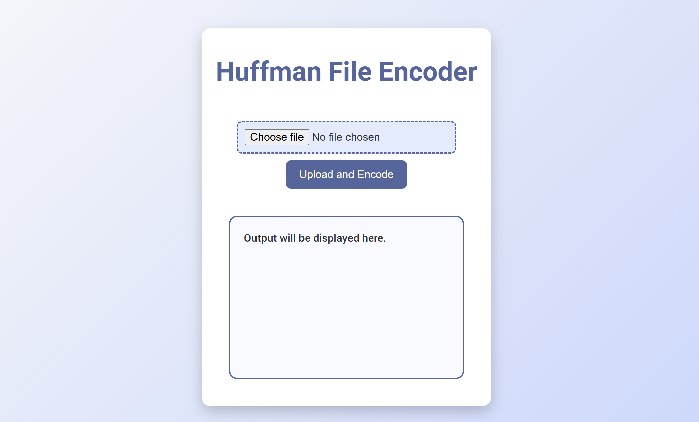
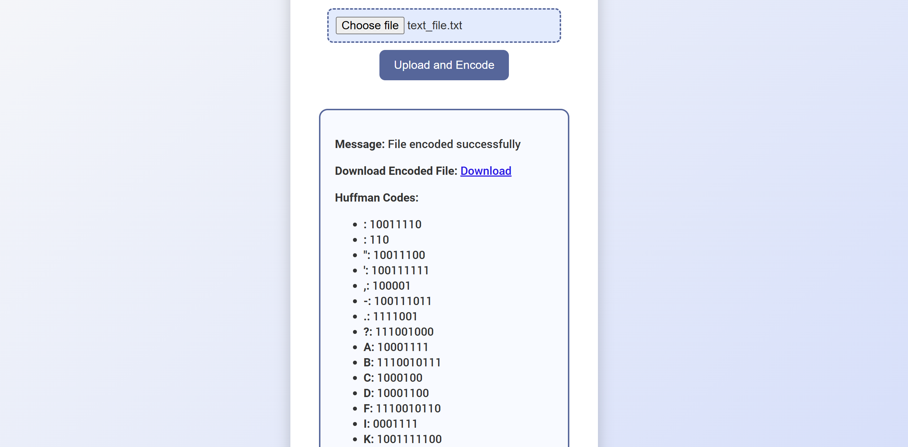
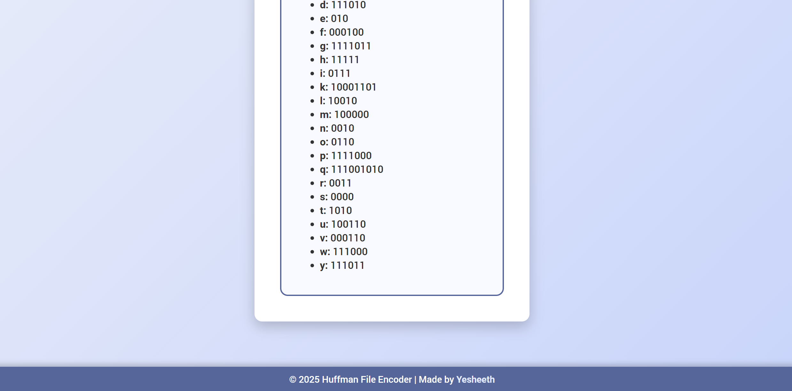
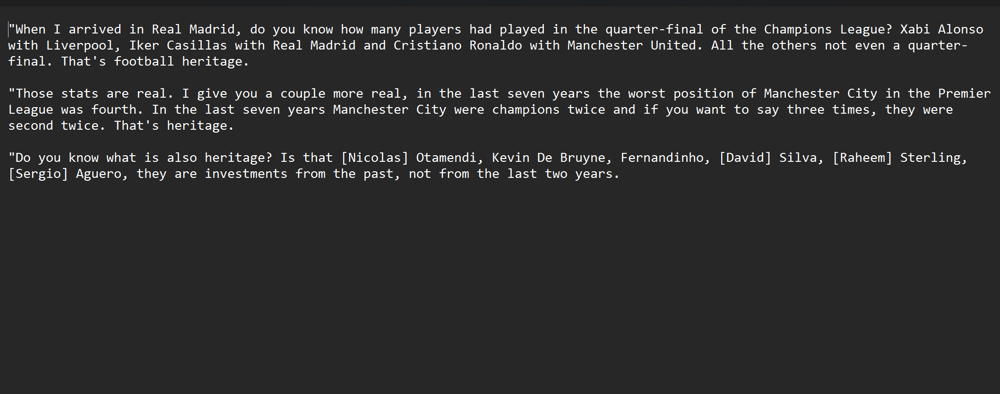

# Huffman_ZIP
"Huffman_ZIP is an innovative web-based tool designed to make text compression and decompression accessible and efficient. Utilizing the power of Huffman coding, a renowned lossless data compression algorithm, it allows users to upload a .txt file, generate a compressed version, and view detailed Huffman codes for each character in the input. The tool also features seamless decompression, enabling users to decode previously encoded files back to their original content. With its intuitive interface and robust backend, Huffman_ZIP is perfect for students, developers, and data enthusiasts interested in exploring the fundamentals of data compression."

## Features  
- **File Compression**: Encode `.txt` files using Huffman coding for efficient storage.  
- **Dynamic Huffman Codes**: View the unique Huffman codes assigned to each character.  
- **Easy File Download**: Download the compressed file directly from the app.  
- **Modern UI**: Enjoy a clean and responsive design with animations.  

## Technologies Used  
- **Frontend**: HTML5, CSS3, JavaScript  
- **Backend**: Python, Flask  
- **Algorithm**: Huffman coding for lossless data compression  

## How to Run  

1.  Clone the repository:  
        ```bash
        git clone https://github.com/yesheeth6/Huffman_ZIP.git

2.  Install resources:
        like python, numpy, Flask

3.  Run the app.py
        python app.py 

4.  Open the Flask server

5.  Upload the text file

    

6. You will get the Huffman codes also packed within the encoded text document

    
    
7. Upload The encoded text file

    

8. Boom !! You will get back the original file!

    
# The End
