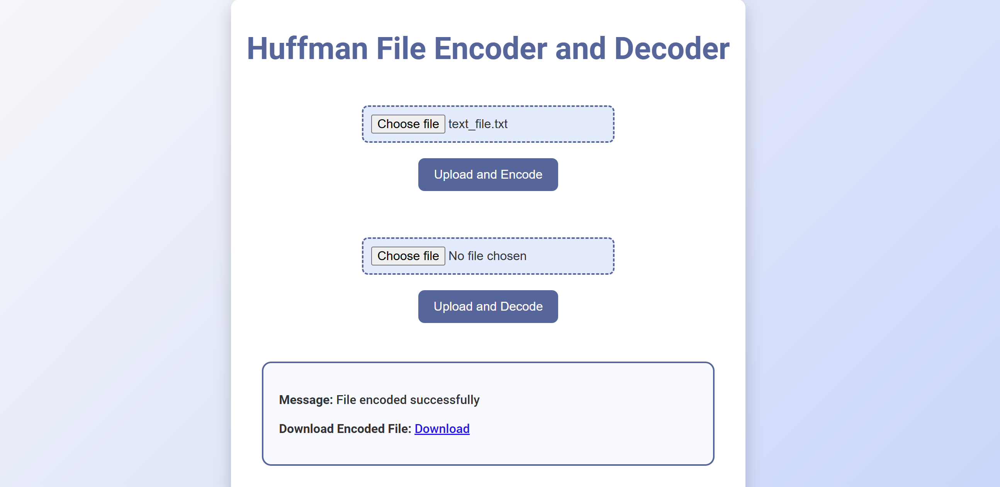
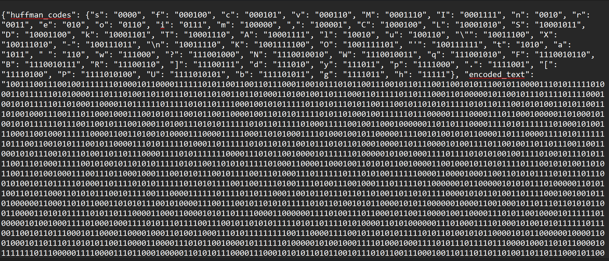
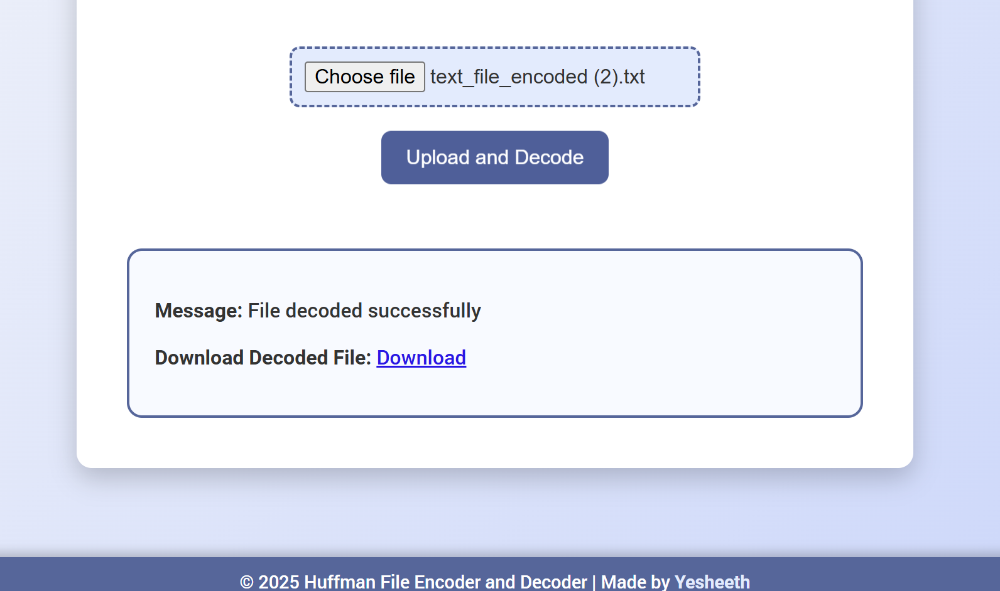

# Huffman_ZIP
HuffEncode is a web-based tool for compressing text files using Huffman coding, a powerful lossless data compression algorithm. Upload a .txt file, and HuffEncode generates a compressed version with detailed Huffman codes for each character. With a sleek interface and efficient backend, it’s perfect for students, developers, or anyone exploring data compression techniques.

## Features  
- **File Compression**: Encode `.txt` files using Huffman coding for efficient storage.  
- **Dynamic Huffman Codes**: View the unique Huffman codes assigned to each character.  
- **Easy File Download**: Download the compressed file directly from the app.  
- **Modern UI**: Enjoy a clean and responsive design with animations.  

## Technologies Used  
- **Frontend**: HTML5, CSS3, JavaScript  
- **Backend**: Python, Flask  
- **Algorithm**: Huffman coding for lossless data compression  

## How to Run  

1.  Clone the repository:  
        ```bash
        git clone https://github.com/yesheeth6/Huffman_ZIP.git

2.  Install resources:
        like python, numpy, Flask

3.  Run the app.py
        python app.py 

4.  Open the Flask server

5.  Upload the text file

    

6. You will get the Huffman codes also packed within the encoded text document

    
    
7. Upload The encoded text file

    

8. Boom !! You will get back the original file!

    
# The End
